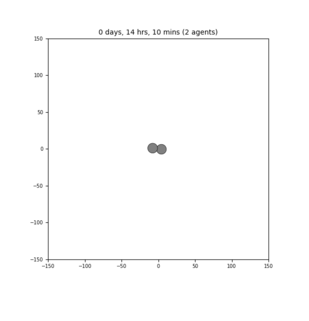
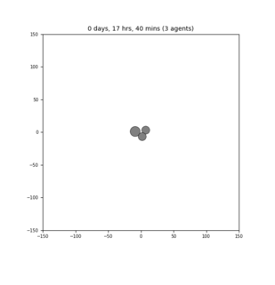
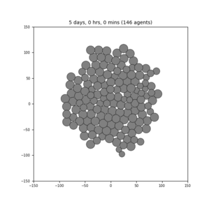
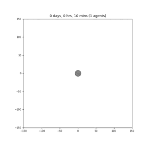

# sample_models
Sample models to compare across frameworks. This repository will describe (and eventually host or link to) sample models - 2D and 3D, simple and more complex.

* cell cycle(s): proliferation
* cell death(s)
* cell volume
* cell mechanics: adhesion/repulsion
* cell mechanics: spring
* cell motility: random/directed
* cell chemotaxis
* cell secretion
* cell morphology
* cell differentiation
* cell phagocytosis
* cell fusion
* monolayer growth
* cell sorting
* wound healing
* tumor growth with heterogeneity

Assumptions?
* default cell volume (e.g., 2494 microns^3)
* default cell cycle --> growth rate(s)
* default cell division criteria
* default cell death rate(s)

## ----- Cell division, no death
### stochastic division, approx every 12 hrs
### --- PhysiCell ---

### --- CC3D ---

## ----- tumor growth with heterogeneity
### --- PhysiCell ---

