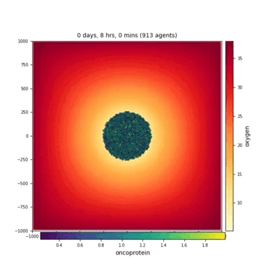

# sample_models
Sample models to compare across frameworks. This repository will describe (and eventually host or link to) sample models - 2D and 3D, simple and more complex.

# Level 0 processes:
* cell cycle(s): [cell growth and division](#cell-growth-and-division) 
* cell death(s)
* cell mechanics: adhesion/repulsion
* cell mechanics: spring
* cell motility
* cell secretion
* cell differentiation
* cell phagocytosis
* cell fusion

# Level 1 processes:
* [cell chemotaxis](#cell-chemotaxis)
* buckling morphogenesis

# Level 2 processes:
* monolayer growth without diffusion
* cell sorting
* wound healing
* [tumor growth with heterogeneity](#tumor-growth-with-heterogeneity)
* basic immunology: epithelial cells, virus, macrophages, more

# Assumptions?
* default cell volume (e.g., 2494 microns^3)
* default cell cycle --> growth rate(s)
* default cell division criteria
* default cell death rate(s)

## cell growth and division

### stochastic division, approx every 12 hrs
### --- PhysiCell ---

 The two animations are not syncronized - the gray-colored cells captures more frames; the colored cells highlight their different volumes.

### --- CC3D ---

## cell chemotaxis
### --- PhysiCell ---

### --- CC3D ---

## tumor growth with heterogeneity
### --- PhysiCell ---

### --- CC3D ---

